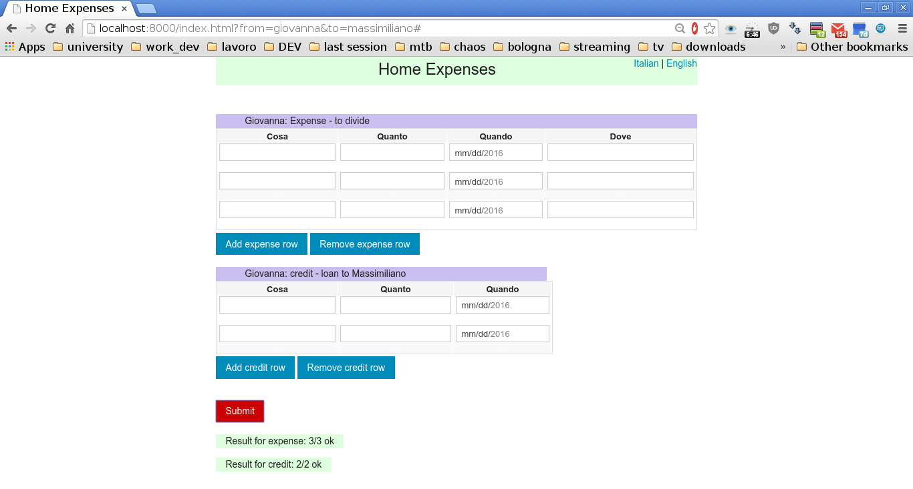

## Conti

Conti is a home expenses management tool: 
 * conti_app is the Android app [conti_app](../../../conti_app)
 * conti_ng is the web client (this one)
 * conti_gas is the backend part, in GoogleAppsScript: it retrieve data from Parse.com (which app and web client send data to), then populate a Spreadsheet with meanful data; finally, the spreadsheet formulas gives results and charts - it is still in development
 
The web client part uses AngularJS with Parse.com Javascript API.

